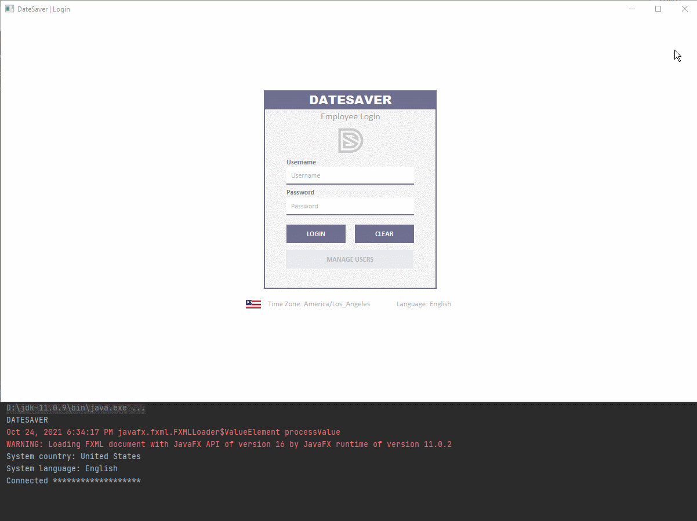

# DateSaver
An appointment-scheduling desktop program.

    

---
## What is it?
The program provides a route for packages to get to their destinations as quickly as possible, while having to deliever through specified cities, multiple trucks, and 

---
## Table of contents
- [Purpose](#purpose)
- [Method](#method)
- [Installation](#installation)
- [Navigation](#navigation)
- [Reflection](#reflection)
- [Links](#links)

---
## Purpose

---
## Method

---
## Installation

---
## Navigation
Run the program from 'main.py'. In the terminal:  
**Make a selection**
- [1] to check on the status of s pecific package, 
  - Enter the package ID to check the status of
  - Enter the time to check the status of the specific package in HH:MM:SS format
- [2] to check on the status of all packages en route. 
  - Enter the time to check the status of all packages in HH:MM:SS format
- The requested information with display with it's delivery status and events

---
## Reflection

---
## Links
